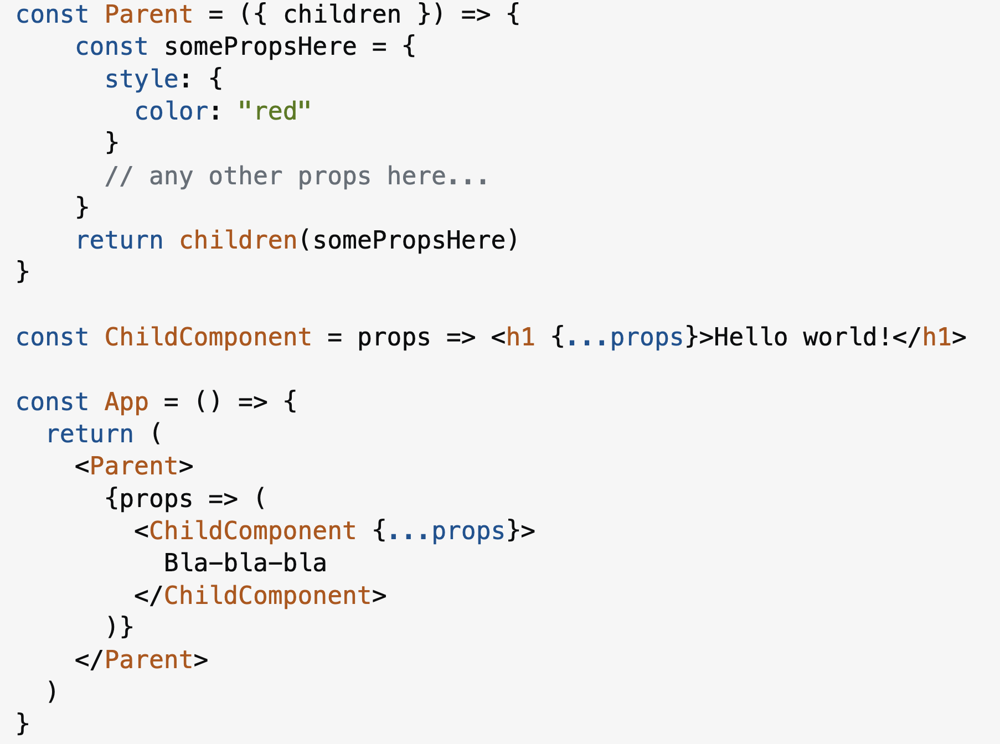
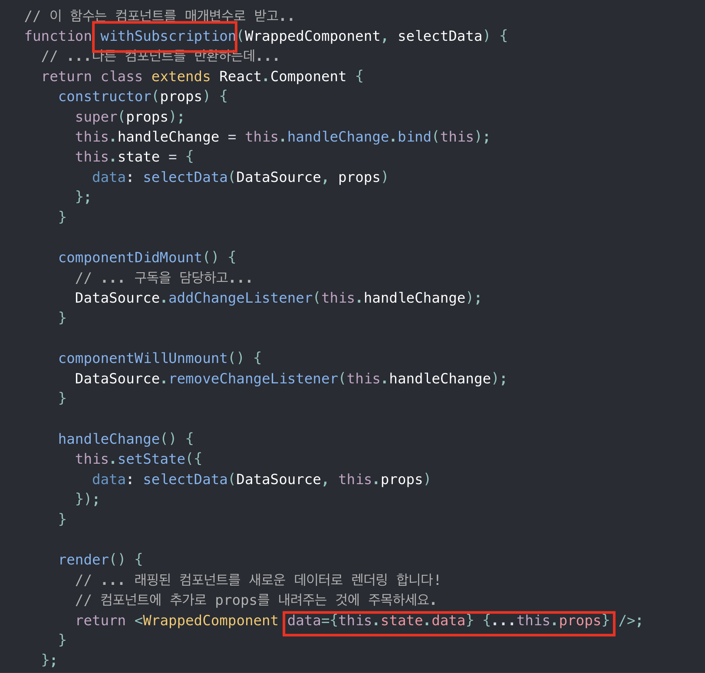
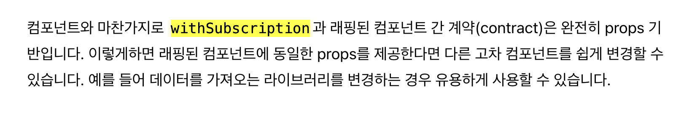

개발을 하다가 부모 컴포넌트에서 자식 컴포넌트에게 props로 전달해야하는 값이 생겼다.
어떻게 전달하면 좋을까?

처음 찾아본 스택 오버 플로우 <em>[링크](https://stackoverflow.com/questions/32370994/how-to-pass-props-to-this-props-children)</em>는 (how to pass props to children?)로 검색해서 찾은 글이다.

Context를 쓰거나 React.cloneElement()를 쓰거나 하는 답변이 있었다.
일단 Context를 쓰는 것은 코드가 많아져서 기능에 비해 과도하다가 느꼈고,
그렇다고 cloneElement는 직관적이지 못하다는 생각이 들었다.

쭉 내리다가 해당 <em>[링크](https://medium.com/merrickchristensen/function-as-child-components-5f3920a9ace9)</em>를 걸어두면서 children을 function 패턴으로 사용할 수 있다는 답변을 발견했다.
항상 `{children}` 이렇게만 써봤지, children을 함수로 쓸 수 있다는 것은 처음 알았다.

일단 그대로 해보니 아주 잘 동작했고, 남는 시간에 찬찬히 미디엄 글을 읽었다.
특히 당시에는 <em>[HOC 패턴](https://ko.legacy.reactjs.org/docs/higher-order-components.html)</em>이 주요했을 때라
과 비교한 부분이 인상적이었다. (사실 그냥 비교한 게 아니라 신랄하게 까고 있다.)
애초에 HOC라는 것을 잘 모르기 때문에 이해하는 데에 시간이 좀 걸렸지만, 왜 hoc 패턴이 최근에는 언급되지 않는지 이해되었다.
그리고 HOC 패턴으로 어떤 것을 시도하려고 했는지, 그리고 한계점은 무엇인지 알게 되었다.

HOC는 횡단 관심사를 묶어서 컴포넌트의 공통된 처리를 위함이었다. 그러나 이러한 공통 처리는 굳이 컴포넌트 자체를 래핑할 필요없이 <strong>hooks</strong>를 통해 처리할 수 있게 되었다.

또한 HOC는 컴포넌트들을 조합 및 합성하여 새로운 컴포넌트를 만들어낼 수 있다는 장점이 있었다. 그러나 이러한 장점은 글을 읽어보니 <strong>function as child 패턴</strong>으로 대체할 수 있었다. 그렇게 hoc 패턴은
점차 잊혀진 패턴이 되어가고 있는듯하다. 이제 막 대학교 4학년 때, 처음 react를
배울 때 해당 패턴이 잘 이해가 안 갔던 기억이 나는데 그이후 3~4년이 지나니 변화가
있는 게 정말 신기하다.

지금의 패턴이나, 코드의 방식도 언제든지 변경되고 레거시가 될 수 있다는 것을 꼭 유념해야겠다.(이미 레거시이긴 한데..)

아래는 미디엄 글에서 본 Function as Child 패턴의 장점을 내가 이해되게 적어둔 발번역이다.

Function as Child 패턴의 장점

1. 합성을 하는 개발자(-> 즉 children을 사용해 합성하고자 하는 개발자)가 해당 속성들이 어떻게 전달되고 사용될 것인지 정한다.
   (-> 합성을 하는 측에 강제되는 룰이라는 게 없다.)
2. 아주 유연한 사용을 위해 'Function as Child Components'의 작성자는 값들을 어떻게 사용할 것인지를
   강제하지 않는다.
3. 사용자(컴포넌트의 사용자)는 HOC에서 넘어오는 프로퍼티를 적용하기 위해 또다른 컴포넌트(\* 아래 사진의 withSubscription)를 만들 필요가 없다.
   HOC는 주로 컴포넌트가 사용될 곳에 속성들의 이름을 강제한다. 이를 회피하기 위해 HOC의 많은 Provider들은
   셀렉터 함수를 제공하는데, 이는 컴포넌트의 사용자가 스스로 프로퍼티의 이름을 정하게 해준다. 'Function as Child Components'에선
   문제 될 일이 아니다.

   

   위의 사진과 같이 HOC패턴은 추가적인 컴포넌트(withSubscription)이 필요한 상황이다.

4. "props"라는 네임스페이스를 오염시키지 않아서 만약 children이 넒이를 계산하는 컴포넌트라면 부모가 Ratio컴포넌트이든지, 핀치줌 컴포넌트이든지 상관없이 사용가능하다.
   HOC는 그들이 합성될 컴포넌트에게 부과될 묵시적인 계약을 수행하고, 불행히도, 이건 prop 이름과 충돌하여 HOC가 다른 컴포넌트들과는 합성될 수 없다는 것을 의미한다.

   

5. HOC는 개발툴이나 컴포넌트 스스로, 우회하는 레이어를 만든다. 예를 들어 HOC에 설정하는 것은 HOC로 래핑된 이후에는 접근할 수 없다.
6. HOC는 합성하는 타이밍의 리액트 상태와 props를 알지 못한다.
   그러나 Funcation as child 패턴에서는 알 수 있기 때문에 합성을 할 때, state, props, context에 접근가능하다.
