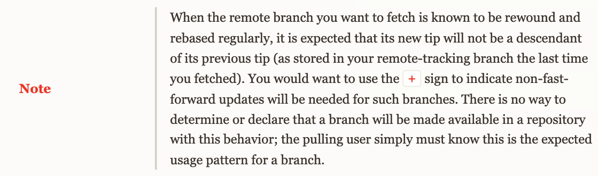

이번주에 git fetch를 할 때 non-fastforward 하다며 fetch가 reject되었다.
fetch는 무조건 fastforward하다고 생각했기 때문에 당황했다.

몇번이고 기존 로컬 브랜치까지 삭제하고 다시 fetch를 해보고 해당 원격 브랜치로 로컬 브랜치를
새로 만들어보았지만, 자꾸 이전 버전의 브랜치를 가리켰다. 분명히 reference 문제가 맞는데 어떻게 업데이트를 해야할까?
(참고로 기존 remote stg가 삭제되고 master기준으로 새로 stg가 생성된 상태이다.)

해결방법은 `.git/config` 파일에 fetch 세팅을 해줄 때 '+refs/heads/mybranch'를 해준 것이다. +를 붙여줘야한다.



> fetch하고 싶은 원격 브랜치가 정기적으로 리베이스 되거나 리와인드 되면,해당 브랜치의 새로운 팁이 이전의 팁의 자식이 아니라는
> 것을 알 수 있습니다. non-fast-forward 업데이트가 필요하다는 것을 가리키기 위해 몇몇 브랜치에서는 +을 사용하길 원할 것입니다.
> 어떤 브랜치가 자주 리베이스되거나 리와인드 될지 알 수 없기 때문에, pull 하는 사용자가 스스로 이런 패턴이 브랜치에 예상된다는 것을 알고 있어야합니다.

그외)
git fetch 문법
다른 레포의 objecs와 refs를 다운받는 것.

```
git fetch [<options>] [<repository> [<refspec>…​]]
git fetch [<options>] <group>
git fetch --multiple [<options>] [(<repository> | <group>)…​]
git fetch --all [<options>]
```

주로 `git fetch origin branchname`을 주로 쓰는 편이다.
origin -> repository이고 url이 되거나 혹슨 다른 리모트 이름을 쓸 수 있다.
branchname -> branchname:를 생략한 것이다. 따라서 source는 있고 destination이 없는 상태.

`<refspec>`을 생략했기 때문에, (branchname이 모호하기 때문에) config 세팅에서 refspec을 가져온다.
refspec에서 가져온 세팅이 만약 'refs/heads/mybranch'라면 'refs/remotes/origin/mybranch'가 업데이트 된다.

(기본적으로 Git은 git remote add 명령으로 생성한 설정을 참고하여 리모트 서버에서 refs/heads/ 에 있는 Refs를 가져다 로컬의 refs/remotes/origin/ 에 기록한다.)

참고:

1. https://git-scm.com/docs/git-fetch/
2. https://stackoverflow.com/questions/50626560/git-fetch-non-fast-forward-update
