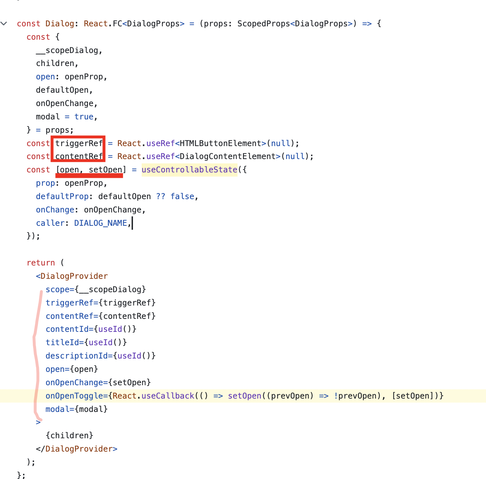
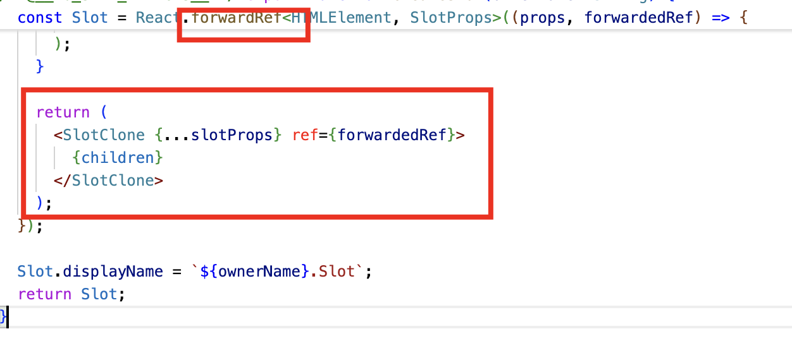
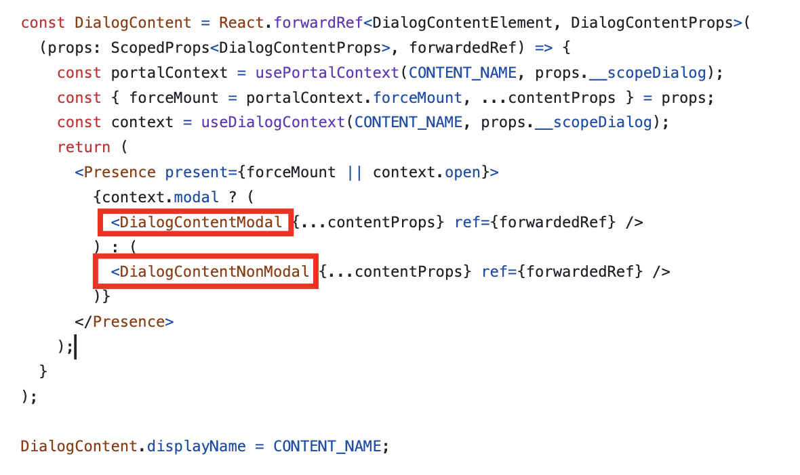
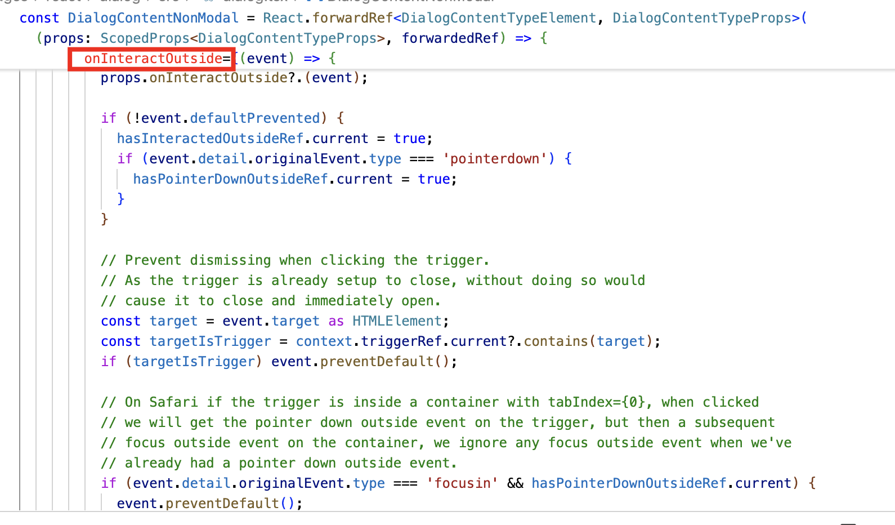
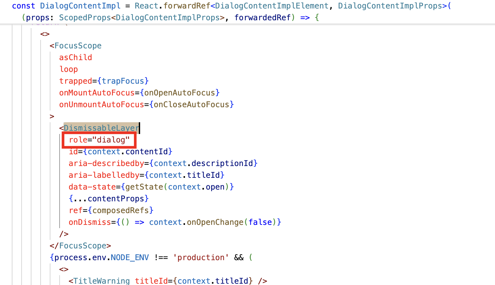
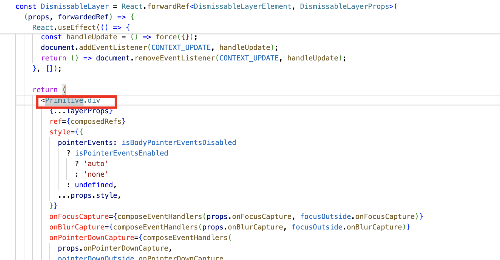
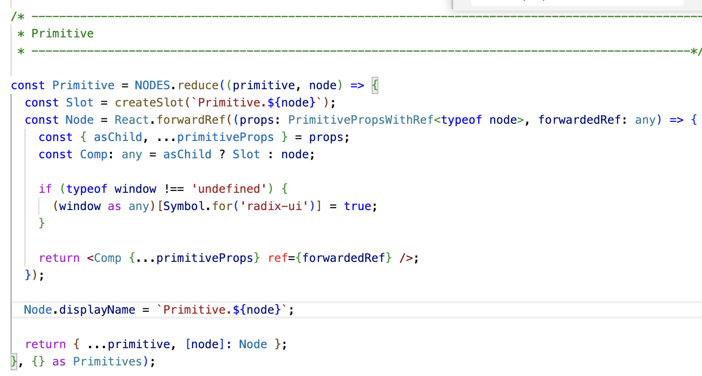

### 들어가며

리액트 실용주의 스터디 1회, 5회 두회차 동안 합성과 모달 UI에 대해 알아봤는데,
해당 스터디 회차 이후 따로 공부하면서 느낀 점을 기록해둔다.

### 헤드레스 UI

헤드레스 UI란 개념을 알게 되었다.
헤드리스 UI는 UI의 스타일을 제공하지 않고, 접근성과 동작 로직만을 제공하는 컴포넌트이다.

유명한 라이브러리 중에는 Radix UI, shadcn/ui 등이 있고, Radix UI의 vision을 읽고
헤드레스 UI의 필요성을 느끼게 되었다.

> Most of us share similar definitions for common UI patterns like accordion, checkbox, combobox, dialog, dropdown, select, slider, and tooltip. These UI patterns are documented by WAI-ARIA and generally understood by the community.
> However, the implementations provided to us by the web platform are inadequate. They're either non-existent, lacking in functionality, or cannot be customized sufficiently.
> So, developers are forced to build custom components; an incredibly difficult task. As a result, most components on the web are inaccessible, non-performant, and lacking important features.
> Our goal is to create a well-funded, open-source component library that the community can use to build accessible design systems.

회사에서 일할 때 프론트 개발은 하지만 퍼블리셔 직군이 따로 있기 때문에, ARIA와 디자인에 대해서는 크게 신경쓰지 못하면서 일했다.

그래서 일을 할 때 디자인 컴포넌트에 대해서는 더 공부할 생각을 하지 못하고, 굉장히 내 자의적으로 해석했다.

그러나 스터디를 하면서 이제라도 WAI-ARIA 공식문서와 관련 라이브러리들을 찾아볼 생각을 하게 되어 참 다행이다.

그럼에도 불구하고, 이러한 문서를 기반으로 충실히 UI 기본 컴포넌트를 만드는 것은 생각보다 어려운 일인데,
헤드레스 UI 를 통해 기능적인 부분은 라이브러리에서 가져올 수 있고,
각 프로젝트에 맞춰서 스타일을 개별적으로 설정할 수 있기 때문에 커스텀이 가능하기 때문에, 새로운 프로젝트를 시작한다면
헤드레스 UI를 사용해보는 것이 좋을 것 같다.

### 다이얼로그-모달 패턴

나는 혼자서 모달 UI는 은근히 현업에서 쓸 때에 불분명한 용어라고 생각을 했다.
누군가는 팝업이라고도 부르고, 뭔가를 클릭해서 뜨는 화면(그것이 화면을 꽉채우든지, 말든지)이 뭐든 모달이 될 수 있었다.

그리고 특히 모달을 여는 방법은 한가지여도 닫는 방법은 참으로 여러가지일 수 있는데, 키보드 Esc 키일수도 있고, 뒤로가기버튼일 수도 있고, 모달의 x버튼일 수도 있다.
그래서 어디까지 지원을 해줘야하는지도 애매하게 느껴졌다.

하지만 아래 공식문서에서 보면 명확히 [다이얼로그-모달 패턴(https://www.w3.org/WAI/ARIA/apg/patterns/dialog-modal/)](https://www.w3.org/WAI/ARIA/apg/patterns/dialog-modal/)에 대해서 정의내리고 있다.

> 다이얼로그는 기본 창 또는 다른 다이얼로그 창 위에 오버레이되는 창입니다. 모달 다이얼로그 아래의 창은 '비활성(inert)' 상태입니다.
> 즉, 사용자는 활성 다이얼로그 창 외부의 콘텐츠와 상호작용할 수 없습니다.
> 일반적으로 다이얼로그 외부의 비활성 콘텐츠는 시각적으로 흐려지거나 어둡게 처리되어 쉽게 구분되지 않으며, 일부 구현에서는 비활성 콘텐츠를 클릭하려 할 경우 다이얼로그가 닫히기도 합니다.

> 모달 다이얼로그는 비모달 다이얼로그처럼 자체적인 탭 순서를 가집니다. 즉, Tab과 Shift + Tab 키는 포커스를 다이얼로그 바깥으로 이동시키지 않습니다.
> 그러나 대부분의 비모달 다이얼로그와 달리, 모달 다이얼로그는 닫지 않고는 포커스를 바깥으로 이동시킬 수 있는 수단을 제공하지 않습니다.
> role="alertdialog"는 사용자 주의를 끌기 위한 중요 메시지용 특수한 다이얼로그입니다. 이에 대한 자세한 내용은 Alert Dialog Pattern에서 설명합니다.

모달 다이얼로그에서 중요한 건 바깥의 UI 흐름과 차단되고, 독자적인 흐름을 가지며, 모달이 활성화될 때에는 바깥의 다이얼로그들은 비활성화되어 상호작용할 수 없는 상태라는 것이다.
반대로 비모달 다이얼로그는 바깥의 UI 흐름과 차단되지 않는다.
이런 비모달 다이얼로그의 예시로는 일반적인 데이터 피커, 검색 필터, 로그인 연장 알림 등 다이얼로그가 띄워진 상태에서도 사용자가 다이얼로그 외의 컨텐츠와 여전히 상호작용할 수 있다는 점에서
비모달 다이얼로그로 분류할 수 있다.

### Radix UI의 다이얼로그

Radix UI의 다이얼로그를 조금 뜯어보면서 헤드레스 UI의 구현과 여러가지 다이얼로그 패턴에 적용할 수 있는 옵션들에 대한 대략적인 감이 왔다.

아래 내용은 Radix UI의 Dialog를 내 나름대로 뜯어보았던 과정으로, 정리된 글이라기보다 해당 라이브러리를 따라가보려는 의식의 흐름(?)을 기록해둔다.

참고가 되는 소스는 [해당 링크](https://github.com/radix-ui/primitives/blob/main/packages/react/dialog/src/dialog.tsx)이다.

큰 구현 패턴은 Context Api를 이용한 합성 컴포넌트(https://www.patterns.dev/react/compound-pattern/)이다.

Dialog 하위 컴포넌트는 모두 forwardRef로 감싸져있다. 이런 패턴은 공통 컴포넌트를 만들 때 참고해보면 좋겟다.
특히 radix ui에서는 asChild props에 대한 설명과 함께 따로 composition에 대한 가이드 문서를 작성하였는데
radix ui에서는 합성을 어떻게 다루고 있는지, 그리고 어떤 방식으로 구현하면 좋을지에 대해 이야기한 글이라 인상 깊었다.

링크 : [https://www.radix-ui.com/docs/primitives/guides/composition](https://www.radix-ui.com/docs/primitives/guides/composition)

예를 들면 리프노드에서는 대부분 `const MyButton = (props) => <button {...props} />;` props를 받을 수 있게 한다거나,
커스텀 컴포넌트에는 되도록 React.forwardRef를 붙이게끔 하는 등이다.

평소에 이러면 좋지 않을까? 하는 부분에서 일치했기 때문이다.

forwardRef로 감싸져있지 않는 컴포넌트들을 합성하려고 했을 때, 또는 돔조작이 필요한 경우 난감했었던 기억,
혹은 필요한 props들을 하나하나 뚫어가면서 했던 경험 때문에, 해당 글이 더 와닿았다.

추가로 asChild prop을 넘기게 되면 렌더프롭으로 처리하나? 했는데 `<Slot>`이라는 컴포넌트에다가 복사하는 방식으로 되어있었다.

아무튼 다시 Dialog로 넘어와서 소스를 보며 인상 깊은 부분은 Radix Primitives Dialog안에서도 Modal과 NonModal로 나누어져있고,
NonModal의 경우 onInteractOutside prop이 있었다. 즉 외부와 상호작용이 가능하다는 것이다.

또한 실제로 role=“dialog”의 역할을 하는 것은 `<DismissableLayer />` 였는데,
해당 컴포넌트 안에서 Esc 키에 대한 처리,포커스처리 등을 담당하고 있다.

특이한 부분은 children등으로 합성을 연속적으로 할 줄 알았는데 내부적으로 Primitive라는 것을 만들어서 prop으로 받은 것을 중에 asChild인 것들만
Slot(새로운 element)을 만들고, 나머지는 Primitive.div인 경우 `
`를 사용하는 식이었다.
Radix ui 라이브러리는 이런 패턴들이 반복적으로 보인다.

