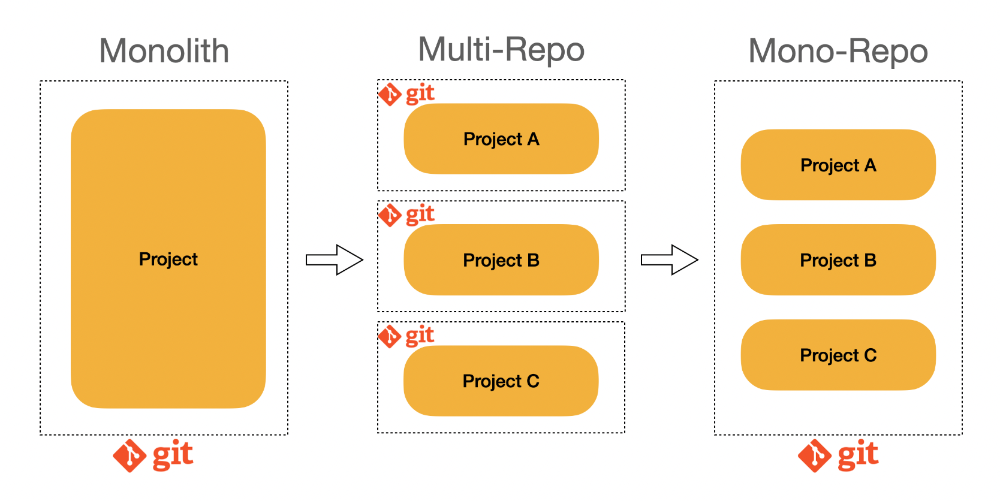

(작년 9월 25일에 사내용으로 작성한 글을 재가공하여 쓴 글입니다. 딱 1년만에 다시 보는 글! 신기하다)

모노레포란 두 개 이상의 프로젝트 코드가 버전관리 시스템 상에서 동일한 저장소에 저장되는 프로젝트 구성기법이다.
예를 들어 주문과 전시의 개별프로젝트 소스가 한 저장소에 저장되는 식으로 말이다.

개별프로젝트 소스가 한 저장소에 저장되는 것이 언뜻 보아서는 어떤 장점이 있는지는 애매할 수 도 있지만 그 배경을 알고나면 끄덕여지는 부분이 있다.
바로 모노레포의 등장은 모놀리식 어플리케이션의 한계에서 출발했다는 점이다.

모노레포? 모놀리식어플리케이션?

단일을 뜻하는 모노라는 단어가 붙었다는 점에서 언뜻 비슷해보이는 이 개념은 완전히 다른 개념을 의미한다.

예를 들어, 주문과 전시가 하나의 프로젝트로 묶인 모놀리식 어플리케이션이 있다고 해보자.
하나의 제품을 위한 각각의 서비스이지만, 하나의 프로젝트로 관리되어왔다.

그러나 시간이 지나고 서비스가 복잡해짐에 따라 관심사 분리의 필요성이 늘어나게 되었다.
그리고 비즈니스의 요구사항은 점점 더 빠르게 변화하고 더 많은 범위의 수정을 가하게 된다.

매번 배포, 리팩토링 등의 작업을 할 때면 거대한 단위로 작업해야하기 때문에 안정성을 위해 영향도를 늘 신경쓸 수 밖에 없고,
이는 개발 프로세스 전체의 비효율을 가져올 수 밖에 없다.

이러한 모놀리식 어플리케이션의 반댓말이 멀티 레포의 개념이며, 모듈화를 통해 서로 독립적인 저장소를 유지하며 독립적으로 개발, 린트, 테스트, 빌드, 배포를 하는 개념이다.

하지만 단점으로
중복코드 가능성,늘어난 프로젝트의 저장수만큼의 관리포인트 증가, 일관성 없는 개발자 경험, 다른 패키지의 변경사항 파악이 어렵다는 단점이 있다.

모노레포는 이러한 멀티 레포의 단점을 보완하기 위해 나온 개념이다. 그 전에 위에서 나온 멀티레포의 단점을 가만히 살펴보자

왜 저런 단점이 생기는 걸까?
그것은 두개 이상의 프로젝트가 완전히 개별적이지 않기 때문이다.
사실 전혀 연관성 없는 프로젝트는 두개의 레포이든 말든 상관이 없다.

하지만 중복코드가 생겨나고, 관리포인트를 함께 관리해야하며, 다른 프로젝트의 패키지 변경사항을 알아야한다는 것은 어느정도 두개의 프로젝트는 연관성을 가진다는 의미가 된다.
모노레포는 중복코드를 공유해서 쓸 수 있고, 별도의 저장소를 생성할 필요없이 동일한 데브옵스를 이요하여 프로젝트를 빌드하고 배포하는 과정을 거치며, 일관된 개발자 경험을 제공하며, 다른 패키지들 간의 변경사항을 파악하기 쉽다.

그러나 모놀로식 어플리케이션과 다르게 서로 다른 프로젝트를 개별적으로 빌드하고 배포할 수 있다.

물론 장점이 많아보이는 모노레포이지만 앞서 말하였듯이 프로젝트가 서로 연관성이 없고, 공통 기능을 재사용하지도, 같이 변경사항을 확인할 필요가 없다면 멀티레포로 관리하는 것이 적절하다.

참고:
[모던 프론트엔드 프로젝트 구성 기법 - 모노레포 개념 편](https://d2.naver.com/helloworld/0923884)
[Turborepo로 모노레포 개발 경험 향상하기](https://engineering.linecorp.com/ko/blog/monorepo-with-turborepo)
