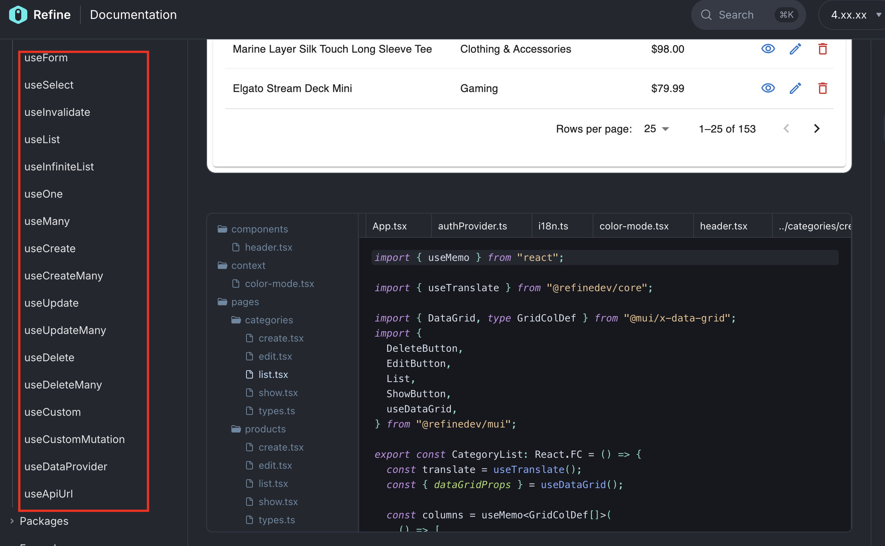
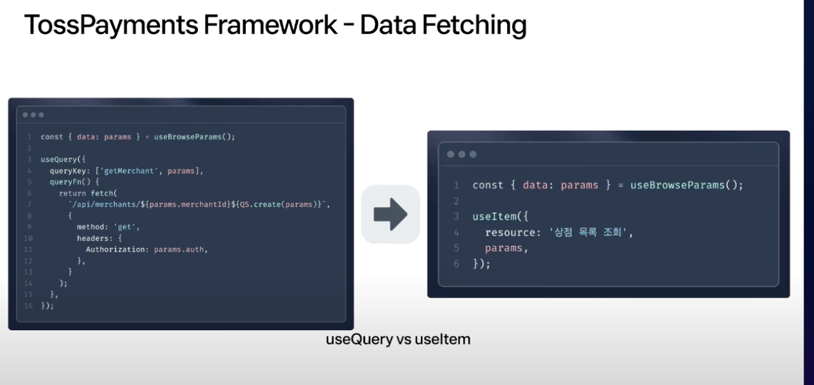

[FEConf 2024 [B1] 바퀴 대신 로켓 만들기](https://www.youtube.com/watch?v=B7hhxG1qUf8&t=937s)를 보고
제 임의대로 요약한 내용입니다.

사견은 추가로 초록색으로 표기하였습니다.

<h2>이슈 내용</h2>
30년 간 지속해온 업이 남긴 유산. 앞으로 나아가야하는 비즈니스에 레거시(jsp, euc-kr)가
발목을 잡는 상황. 400개 넘는 화면들이 레거시

-> 팀에서 관리 가능한 형태로 이관 필요

6개월 내에 400개..화면.. 4명 fe / 짧은 시간에 지속가능한 형태로 만드는 데에 대한 부담.

바로 개발에 착수하기 어려운 상황!

<strong>
  1)디자인에 대한 프로토타입 / 2)요구사항 분석 / 3) 서버에 대한 준비 등이 필요
</strong>

개발 도중에 협업 및 커뮤니케이션 시간이 들어가게 됨. + 기능 개발 자체 + 유지보수 비용

<h2>프론트엔드 개발의 병목</h2>

<h3>1. 디자인 프로토타입이 꼭 필요한가?</h3>

디자인 비효율을 줄일도구인 토스 디자인 시스템을 사용하고 있지만 한계가 있음
토스의 모든 계열사들이 사용하고 있고, 계열사의 요구사항을 모두 맞춤
개별 회사의 니즈를 맞추기 어려움.

디지인 시스템의 장점(아토믹 / 유연성 / 재사용성)이 있지만

작성하는사람마다 다른 구현체 (프로덕트 시스템에서는 단일 구현체를 제공하도록 함.)/
를 가져가는 것이 문제적이라고 간주.

아토믹한 구조를 추구하기보단 구체적인 맥락이 들어가더라도 반복 사용하기 좋은 형태
서로 다른 인터페이스로 구현할 가능성 방지.
명확한 역할의 컴포넌트를 정의하여 가독성과 유지보수성 향상을 할 수 있는

——> 프로덕트 시스템 제안
페이먼츠에 최적화된 단일 구현체를 만들기 시작

아토믹한 범위에서 벗어나서 가장 큰 영역 (스크린)까지 다양한 variation을 커버.

<h3> 2. 서버 api가 꼭 필요한가?</h3>

<strong>프론트엔트는 api 구현보다 인터페이스가 필요하다.</strong>

Swagger / rest docs
스펙을 한땀한땀 이관 후 데이터 페칭할 때 문제가 생기면 서버 개발자에게 요청.
-> 이런 과정의 반복

Openapi code generator -> TossPayments의 codegen
Open api json schema를 원하는 방식으로 다듬기 / typescript와 zod 기반

- Swagger docs url로부터 open api spec 객체 생성
- spec.components -> request body/ response에 대한 zod 스키마
- Spec.paths로부터 api endpoint를 비롯한 각종 스펙을 원하는 객체형태로 가공
- Ts 파일을 원하는 위치에 생성

  개인적으로 다 중요하지만 ‘원하는 위치에 생성’도 꽤나 중요하다고 생각. 한 곳에
  몰아서 다 만들어져서 diff도 잡히기 어려운 너무 거대한 파일이 된 케이스도
  보았기 때문이다.

장점: 스펙 싱크를 신경쓰지 않고, 재사용 가능한 타입과 스키마

<h3> 3. 외적인 요소(요구사항 분석)와 상관없이 fe개발 자체의 비효율은?</h3>

개발 생태계가 너무 풍부하기 때문에 발생하기 때문에
개발자마다 나오는 형태가 다다름

-> 새로운 바퀴를 만드는 일보다 일관성 있고 지속 가능한 코드를 만드는 일이 필요.

그렇다면 어떻게 공통화할 수 있을까?

발표자분께서는 Refine(https://refine.dev/)에서 영감 받았다고 하셨다.
한 번 들어가서 살펴봤는데, 망치로 뿅맞은 기분이었다.

4가지(Data fetching , Form Control, Table, Logging)에 대한 각각의 공통화할 수 있는 부분이 나왔는데, Data Fetching만 보면 아래와 같은 식이다.

  공통화된 메서드의 파라미터을에 대한 커스텀을 어디까지 할 것인가의 문제도
  분명히 있겠지만, 합의된 파라미터만 잘 정의한다면 무척이나 좋을 듯했다.
  비슷비슷한 기능을 전 파트에 걸쳐서 반복 작업하는 것 같은 느낌을 구체적으로
  확인해볼 수 있기도 했다. 하지만 일을 하다보면 각각의 파트 혹은 팀에서
  구현해야하는 기능에 집중할 수 밖에 없는데, 공통 컴포넌트의 관리의 주체가
  애매해지는 상황이 발생한 적이 있었다. 디자인 시스템으로 관리되는 디자인
  컴포넌트는 통일성 있고 일관되게 갈 수 있는데, 실제로 데이터를 페칭하고 기능을
  수행하는 컴포넌트의 내부 구현은 다 다르게 되어, 파트마다 구현 방식이 달라 이런
  방식이 필요하다고는 생각되지만, 실제로 일할 때 나서서 맞추자!!하기가 어려울 것
  같은 것도 사실이다. 새로 만든 프로젝트라면 이렇게 가면 참 좋겠다.

