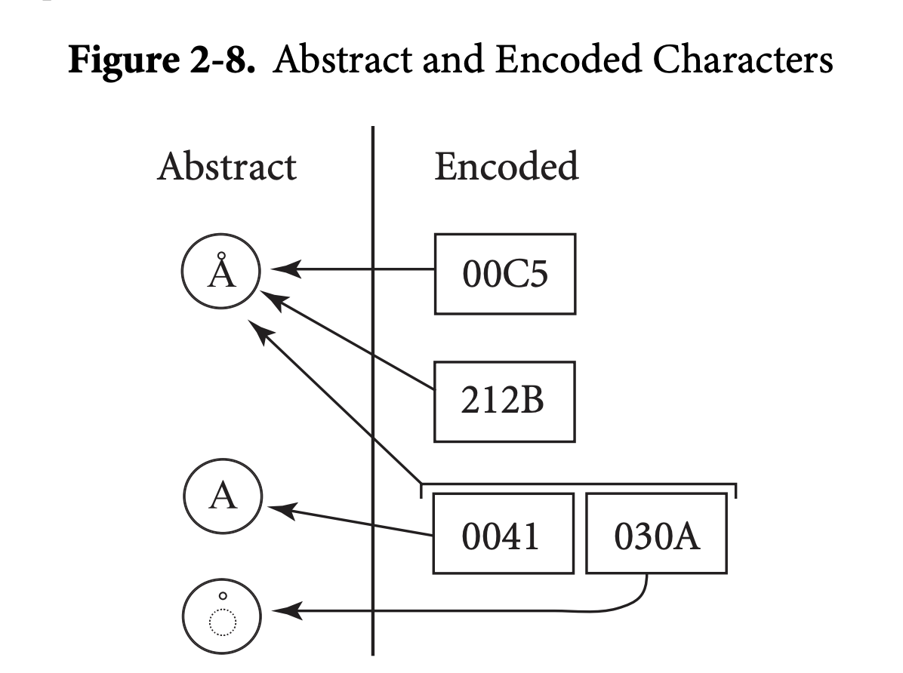
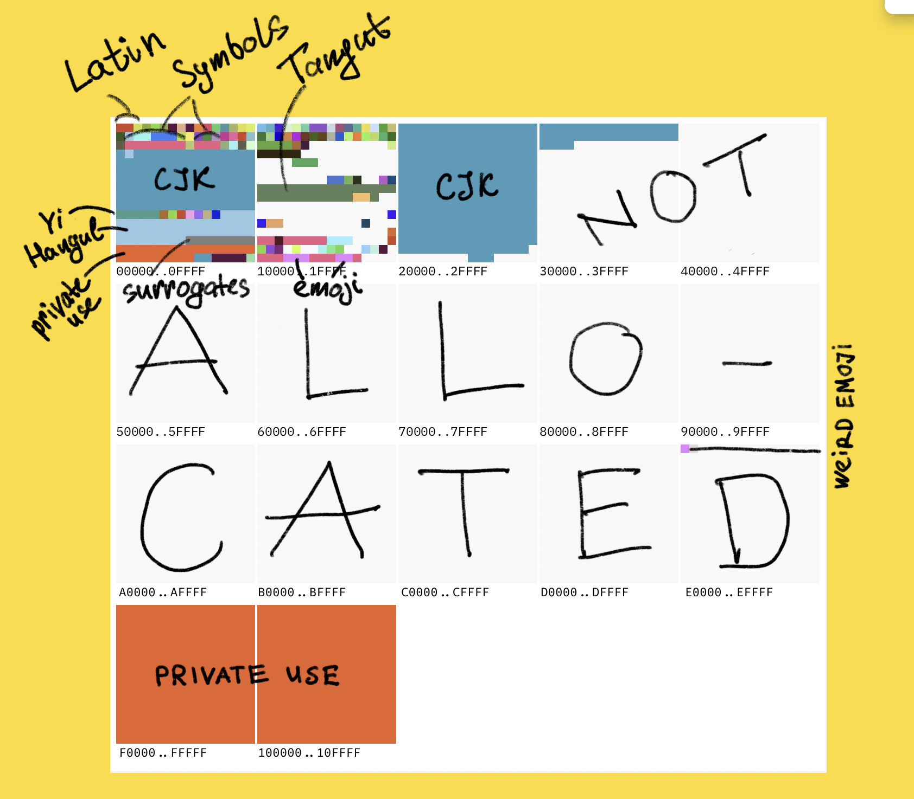

## 계기: 이모지 깨짐 현상 대응

회사에 공통 유틸로 사용하는 것이 있어서 대응 자체는 쉽게 했지만, 유니코드를 이번 기회에 조금 공부해봤다.
그런데 봐도봐도 내용이 길어져서 일단 아주 기초적인 내용만 공부하고 나중에 더 자세히 알아봐야지.

## 코드 포인트란?

텍스트를 표현하기 위한 시스템(예, 유니코드)에서 추상 문자를 나타내기 위해 할당된 숫자값이다.
[codepoint 참고 링크(1) - https://developer.mozilla.org/ko/docs/Glossary/Code_point](https://developer.mozilla.org/ko/docs/Glossary/Code_point)
[codepoint 참고 링크(2) - https://www.unicode.org/versions/Unicode14.0.0/ch02.pdf#G25564](https://www.unicode.org/versions/Unicode14.0.0/ch02.pdf#G25564)


### 유니코드 평면

- 0x10FFFF까지 존재하는데, 0x10FFFF는 1,114,111개의 코드포인트를 나타낸다.
- 아직도 할당되지 않은 유니코드 코드스페이스(?)가 이렇게 많을 줄이야! 고정길이 utf-16에 크게 데여서 그런가...
  

## utf-8, utf-16 그리고 surrogate pair

이 세개가 계속 헷갈렸다. 특히 java랑 javascript는 내부적으로 문자열을 utf-16으로 처리해서,
utf-8이 표준이라면서 왜 이러는거야? 계속 의문이었다.

이걸 알려면 unicode의 히스토리를 알아야했다.
처음 유니코드 v1에서는 utf-16의 고정 길이 방식이 표준이었다고 한다.

2^16, 즉 65536개의 코드 포인트만 지원했는데, 이것이 ucs-2 방식이라고도 부르며
이때 만들어진 코드들이 bmp(basic multilingual plane - 다국어 기본 평면) 영역에 할당되어 있다.

그러나 자연스럽게 65536개가 부족해지면서 surrogate pair라는 방식이 생겼는데,
bmp 영역을 넘어서는 글자에 대하여 이것은 2개의 16비트 코드 유닛을 사용해서 하나의 코드포인트를 표현하는 방식이다.

javascript에서는 마찬가리로 구형에서는 이 surrogate pair 방식으로 utf-16을 사용하였다. 단 es2015(es6)에서부터 서로게이트 쌍을 코드 포인트 단위로 다룰 수 있는 API들이 추가되었다.

### 기존

[String.fromCharCode()](https://developer.mozilla.org/ko/docs/Web/JavaScript/Reference/Global_Objects/String/fromCharCode)
[String.prototype.charCodeAt()](https://developer.mozilla.org/ko/docs/Web/JavaScript/Reference/Global_Objects/String/charCodeAt)

```javascript
"😊".length; // 2 (서로게이트 쌍 2개로 봄)
"😊"[0]; // "\uD83D" (깨진 문자)
"😊".charCodeAt(0); // 55357 (상위 서로게이트 값)
```

### ES2015 표준

[String.fromCodePoint()](https://developer.mozilla.org/ko/docs/Web/JavaScript/Reference/Global_Objects/String/fromCodePoint)
[String.prototype.codePointAt()](https://developer.mozilla.org/ko/docs/Web/JavaScript/Reference/Global_Objects/String/codePointAt)

```
"😊".codePointAt(0)       // 128522 (U+1F60A, 제대로 된 값)
[..."😊"].length           // 1 (스프레드가 코드 포인트 단위로 분리)
"😊".normalize()           // 유니코드 정규화 가능
```

단 utf-8이 표준이 된 이유는 프로그래밍 언어 내부의 문제가 아니라, 웹, 네트워크, 파일 시스템 등에서의 기존 ascii와의 호환성 문제 뿐만 아니라
유니코드(110만+글자)표현 시 가변길이로 인한 네트워크 전송 효율화 때문이라고 한다.

따라서 언어 내부에서 UTF-16으로 처리하더라도, 밖으로 나가는 순간 항상 UTF-8로 변환된다는 점에 유의해야한다.

## DB 캐릭터셋과 타입

DB는 캐릭터셋은 두 가지 개념이 합쳐져있다.

1. 문자집합 - ex) 유니코드, EUC-KR, ASCII 등
2. 인코딩 방식 - ex) UTF-8, UTF-16, EUC-KR 등

- 비교/정렬 방식이 추가가 된다. 대소문자 구분을 할것인지 등등. (collation)

### 오라클

UTF-8 : Oracle 구버전. BMP만 지원 (U+FFFF까지) → 이모지 ❌
AL32UTF8 :전체 유니코드 지원 → 이모지 ✅

- varchar2는 원래 이모지 저장이 안되는 줄 알았는데, db 캐릭터셋이 AL32UTF8로 설정되어 있다면 varchar2에서도 이모지 저장이 가능하겠다.!

  (참고: Oracle Database 12c Release 2 (12.2.0.1)에서 AL32UTF8 캐릭터셋이 UTF-8 인코딩을 지원하도록 개선되었다. )

varchar2와 nvarchar2 비교

<table>
  <thead>
    <tr>
      <th>항목</th>
      <th>VARCHAR2</th>
      <th>NVARCHAR2</th>
    </tr>
  </thead>
  <tbody>
    <tr>
      <td>인코딩</td>
      <td>DB 캐릭터셋 따라감</td>
      <td>항상 UTF-16 (or UTF-8)</td>
    </tr>
    <tr>
      <td>한글 저장</td>
      <td>DB 설정에 따라 다름</td>
      <td>항상 가능</td>
    </tr>
    <tr>
      <td>바이트 계산</td>
      <td>인코딩마다 다름</td>
      <td>고정적</td>
    </tr>
    <tr>
      <td>N prefix 의미</td>
      <td>-</td>
      <td>National character set</td>
    </tr>
  </tbody>
</table>

### mysql

utf8 : 3바이트까지만 지원 → 이모지 ❌
utf8mb4 : 4바이트까지 지원 → 이모지 ✅

utf8mb4_general_ci → 빠르지만 정확도 낮음 (구버전)

utf8mb4_unicode_ci → 유니코드 표준 정렬 (권장)

utf8mb4_0900_ai_ci → MySQL 8.0+ 기본값, 가장 최신
